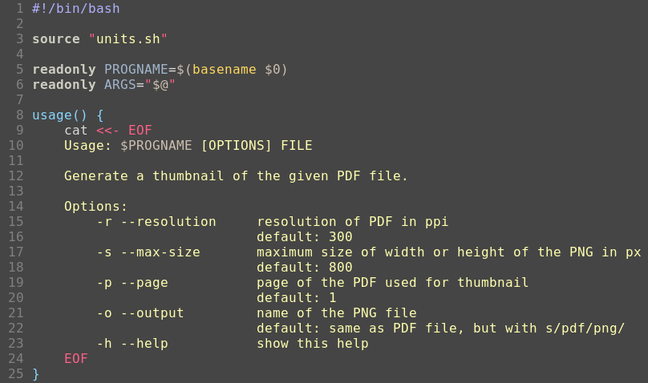

# bubblelights

A colortheme for vim based on [bubblegum] and [southernlights].



[bubblegum]: https://github.com/baskerville/bubblegum
[southernlights]: https://github.com/jalvesaq/southernlights


## Installation

Add it as a package to vim
(see `:help packages`)
with:

```bash
mkdir -p ~/.vim/pack/colors/opt/bubblelights/colors/
wget https://github.com/hagenw/bubblelights/raw/main/colors/bubblelights.vim \
     -O ~/.vim/pack/colors/opt/bubblelights/colors/bubblelights.vim
```

Then enable the colorscheme in your `~/.vimrc` with the following command:

```vim
colorscheme bubblelights
```

If you only use GVim, you're done! If you use terminal Vim, read on...

Bubblelights supports 256 color terminals, but it makes use of redefinitions of
the basic terminal colors to get some additional colors.  Open your `~/.vimrc`
with Vim in your terminal and try `:set termguicolors`. If colors are rendered
properly, you can add this command in your `~/.vimrc`.  If not, configure your
terminal emulator to use the color palette given below.

## Terminal color palette


| colors                         | cterm | gui     |   | colors                         | cterm | gui     |
|:------------------------------:|:-----:|:-------:|---|:------------------------------:|:-----:|:-------:|
|    | 0     | #454545 |   |    | 8     | #71a3b7 |
|    | 1     | #dca3a3 |   |    | 9     | #f4a45f |
|    | 2     | #afc5af |   |  | 10    | #95c749 |
|    | 3     | #ffffef |   |  | 11    | #cdcdc1 |
|    | 4     | #9eaa00 |   |  | 12    | #1cc7c9 |
|    | 5     | #cdbfaf |   |  | 13    | #cdbfaf |
|    | 6     | #a1b5cd |   |  | 14    | #a1b5cd |
|    | 7     | #dedede |   |  | 15    | #dedede |
|                                |       |         |   |                                |       |         |
|      | fg    | #d1d1d1 |   |      | bg    | #454545 |


## Plugins support

Bubblelights provides color definitions for the following plugins:

* [Buftabline](https://github.com/ap/vim-buftabline)
* [ctrlp](https://github.com/ctrlpvim/ctrlp.vim)
